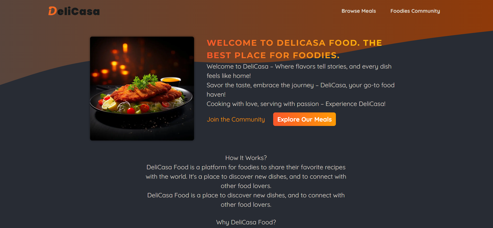

<div align="center">
  <br />
    <a href="https://food-blog-next-js-six.vercel.app/" target="_blank">
      
    </a>
  <br />

  <br />
  <div>
    
    
    
    
    
    
  </div>

  <h1 align="center">DeliCasa | Where Every Bite Feels Like Home!</h1>

   <div align="center">
    DeliCasa is a modern food blog built with Next.js and React, designed to bring you the best home-cooked recipes and culinary tips. Our mission is to make every meal feel like a comforting experience, just like home. With a focus on simplicity and flavor, DeliCasa offers a wide range of recipes that cater to all tastes and dietary preferences. Whether you're a seasoned chef or a kitchen novice, you'll find something to inspire your next meal.
    </div>
</div>

## 📋 <a name="table">Table of Contents</a>

1. 🤖 [Introduction](#introduction)
2. ⚙️ [Tech Stack](#tech-stack)
3. 🔋 [Features](#features)
4. 🤸 [Quick Start](#quick-start)
5. 🕸️ [Code Snippets](#scode-nippets)
6. 🚀 [More](#more)

## <a name="introduction">🤖 Introduction</a>

DeliCasa is a dynamic food blog platform built with Next.js, React.js, HTML5, CSS3, and powered by AWS Web Services for seamless data management. At DeliCasa, food enthusiasts can discover a wide variety of recipes from across the globe, explore diverse culinary traditions, and share their own favorite recipes with a global community. Whether you're a seasoned chef or a passionate home cook, DeliCasa provides the perfect space to explore, create, and connect over delicious dishes. 🌍🍴

## <a name="tech-stack">⚙️ Tech Stack</a>

- Next JS
- React JS
- AWS Web Service
- HTML 5
- CSS 3

## <a name="features">🔋 Features</a>

👉 Explore a vast collection of food recipes from around the world.

👉 Publish your own favorite recipes and share them with the community.

👉 Option to upload recipe images, ingredients, and cooking instructions.

👉 Fully mobile-friendly and responsive, ensuring an optimal experience across all devices.

👉 Browse through various categories such as vegan, vegetarian, desserts, snacks, and more.

👉 Share recipes on social media directly from the website to inspire your followers.

👉 Reliable and scalable cloud infrastructure to manage and store recipes and user data securely.

👉 Step-by-step cooking instructions with helpful images and videos to guide users.

👉 Follow other food enthusiasts, comment on their recipes, and engage in the community.

## <a name="quick-start">🤸 Quick Start</a>

Follow these steps to set up the project locally on your machine.

**1. Clone the repo:**

```bash
git clone https://github.com/MenathNDGD/Food-Blog-NextJS.git
```

**2. Navigate to the project directory:**

```bash
cd Food-Blog-NextJS
```

**3. Install dependencies:**

```bash
npm install
```

**4. Set up environment variables:**

- Create a `.env` file in the root directory and add the following:

```bash
AWS_ACCESS_KEY_ID=your_aws_access_key_id
AWS_SECRET_ACCESS_KEY=your_aws_secret_access_key

NEXT_PUBLIC_AWS_S3_BUCKET_NAME=your_bucket_name
NEXT_PUBLIC_AWS_S3_BUCKET_URL=your_bucket_url
NEXT_PUBLIC_AWS_S3_REGION=your_region
NEXT_PUBLIC_AWS_S3_DOMAIN=your_domain
```

**5. Start the development server:**

```bash
npm run dev
```

Open [http://localhost:3000](http://localhost:3000) in your browser to view the project.

## <a name="code-snippets">🕸️ Code Snippets</a>

<details>
<summary><code>initdb.js</code></summary>

```javascript
const sql = require("better-sqlite3");
const db = sql("meals.db");

const dummyMeals = [
  {
    title: "Juicy Cheese Burger",
    mealId: "juicy-cheese-burger",
    image: "burger.jpg",
    summary:
      "A mouth-watering burger with a juicy beef patty and melted cheese, served in a soft bun.",
    instructions: `
      1. Prepare the patty:
         Mix 200g of ground beef with salt and pepper. Form into a patty.

      2. Cook the patty:
         Heat a pan with a bit of oil. Cook the patty for 2-3 minutes each side, until browned.

      3. Assemble the burger:
         Toast the burger bun halves. Place lettuce and tomato on the bottom half. Add the cooked patty and top with a slice of cheese.

      4. Serve:
         Complete the assembly with the top bun and serve hot.
    `,
    creator: "John Doe",
    creator_email: "johndoe@example.com",
  },
  {
    title: "Spicy Curry",
    mealId: "spicy-curry",
    image: "curry.jpg",
    summary:
      "A rich and spicy curry, infused with exotic spices and creamy coconut milk.",
    instructions: `
      1. Chop vegetables:
         Cut your choice of vegetables into bite-sized pieces.

      2. Sauté vegetables:
         In a pan with oil, sauté the vegetables until they start to soften.

      3. Add curry paste:
         Stir in 2 tablespoons of curry paste and cook for another minute.

      4. Simmer with coconut milk:
         Pour in 500ml of coconut milk and bring to a simmer. Let it cook for about 15 minutes.

      5. Serve:
         Enjoy this creamy curry with rice or bread.
    `,
    creator: "Max Schwarz",
    creator_email: "max@example.com",
  },
  {
    title: "Homemade Dumplings",
    mealId: "homemade-dumplings",
    image: "dumplings.jpg",
    summary:
      "Tender dumplings filled with savory meat and vegetables, steamed to perfection.",
    instructions: `
      1. Prepare the filling:
         Mix minced meat, shredded vegetables, and spices.

      2. Fill the dumplings:
         Place a spoonful of filling in the center of each dumpling wrapper. Wet the edges and fold to seal.

      3. Steam the dumplings:
         Arrange dumplings in a steamer. Steam for about 10 minutes.

      4. Serve:
         Enjoy these dumplings hot, with a dipping sauce of your choice.
    `,
    creator: "Emily Chen",
    creator_email: "emilychen@example.com",
  },
  {
    title: "Classic Mac n Cheese",
    mealId: "classic-mac-n-cheese",
    image: "macncheese.jpg",
    summary:
      "Creamy and cheesy macaroni, a comforting classic that's always a crowd-pleaser.",
    instructions: `
      1. Cook the macaroni:
         Boil macaroni according to package instructions until al dente.

      2. Prepare cheese sauce:
         In a saucepan, melt butter, add flour, and gradually whisk in milk until thickened. Stir in grated cheese until melted.

      3. Combine:
         Mix the cheese sauce with the drained macaroni.

      4. Bake:
         Transfer to a baking dish, top with breadcrumbs, and bake until golden.

      5. Serve:
         Serve hot, garnished with parsley if desired.
    `,
    creator: "Laura Smith",
    creator_email: "laurasmith@example.com",
  },
  {
    title: "Authentic Pizza",
    mealId: "authentic-pizza",
    image: "pizza.jpg",
    summary:
      "Hand-tossed pizza with a tangy tomato sauce, fresh toppings, and melted cheese.",
    instructions: `
      1. Prepare the dough:
         Knead pizza dough and let it rise until doubled in size.

      2. Shape and add toppings:
         Roll out the dough, spread tomato sauce, and add your favorite toppings and cheese.

      3. Bake the pizza:
         Bake in a preheated oven at 220°C for about 15-20 minutes.

      4. Serve:
         Slice hot and enjoy with a sprinkle of basil leaves.
    `,
    creator: "Mario Rossi",
    creator_email: "mariorossi@example.com",
  },
  {
    title: "Wiener Schnitzel",
    mealId: "wiener-schnitzel",
    image: "schnitzel.jpg",
    summary:
      "Crispy, golden-brown breaded veal cutlet, a classic Austrian dish.",
    instructions: `
      1. Prepare the veal:
         Pound veal cutlets to an even thickness.

      2. Bread the veal:
         Coat each cutlet in flour, dip in beaten eggs, and then in breadcrumbs.

      3. Fry the schnitzel:
      Heat oil in a pan and fry each schnitzel until golden brown on both sides.

      4. Serve:
      Serve hot with a slice of lemon and a side of potato salad or greens.
 `,
    creator: "Franz Huber",
    creator_email: "franzhuber@example.com",
  },
  {
    title: "Fresh Tomato Salad",
    mealId: "fresh-tomato-salad",
    image: "tomato-salad.jpg",
    summary:
      "A light and refreshing salad with ripe tomatoes, fresh basil, and a tangy vinaigrette.",
    instructions: `
      1. Prepare the tomatoes:
        Slice fresh tomatoes and arrange them on a plate.
    
      2. Add herbs and seasoning:
         Sprinkle chopped basil, salt, and pepper over the tomatoes.
    
      3. Dress the salad:
         Drizzle with olive oil and balsamic vinegar.
    
      4. Serve:
         Enjoy this simple, flavorful salad as a side dish or light meal.
    `,
    creator: "Sophia Green",
    creator_email: "sophiagreen@example.com",
  },
];

db.prepare(
  `
   CREATE TABLE IF NOT EXISTS meals (
       id INTEGER PRIMARY KEY AUTOINCREMENT,
       mealId TEXT NOT NULL UNIQUE,
       title TEXT NOT NULL,
       image TEXT NOT NULL,
       summary TEXT NOT NULL,
       instructions TEXT NOT NULL,
       creator TEXT NOT NULL,
       creator_email TEXT NOT NULL
    )
`
).run();

async function initData() {
  const stmt = db.prepare(`
      INSERT INTO meals VALUES (
         null,
         @mealId,
         @title,
         @image,
         @summary,
         @instructions,
         @creator,
         @creator_email
      )
   `);

  for (const meal of dummyMeals) {
    stmt.run(meal);
  }
}

initData();
```

</details>

<details>
<summary><code>lib --> actions.js</code></summary>

```javascript
"use server";

import { revalidatePath } from "next/cache";
import { redirect } from "next/navigation";
import { v4 as uuidv4 } from "uuid";

import { saveMeal } from "./meals";

function isInvalidText(text) {
  return !text || text.trim() === "";
}

export async function shareMeal(prevState, formData) {
  const errors = {};

  const meal = {
    title: formData.get("title"),
    summary: formData.get("summary"),
    instructions: formData.get("instructions"),
    image: formData.get("image"),
    creator: formData.get("name"),
    creator_email: formData.get("email"),
    mealId: uuidv4(),
  };

  if (isInvalidText(meal.title)) errors.title = "Title is required!";
  if (isInvalidText(meal.summary)) errors.summary = "Summary is required!";
  if (isInvalidText(meal.instructions))
    errors.instructions = "Instructions are required!";
  if (isInvalidText(meal.creator)) errors.creator = "Your name is required!";

  if (isInvalidText(meal.creator_email)) {
    errors.creator_email = "Email is required!";
  } else if (!meal.creator_email.includes("@")) {
    errors.creator_email = "Invalid email format!";
  }

  if (!meal.image || meal.image.size === 0) {
    errors.image = "Image is required!";
  }

  if (Object.keys(errors).length > 0) {
    return { errors };
  }

  await saveMeal(meal);
  revalidatePath("/", "layout");
  redirect("/meals");
}
```

</details>

<details>
<summary><code>lib --> meals.js</code></summary>

```javascript
import { S3 } from "@aws-sdk/client-s3";

import sql from "better-sqlite3";
import slugify from "slugify";
import xss from "xss";

const s3 = new S3({
  region: process.env.NEXT_PUBLIC_AWS_S3_REGION,
});

const db = sql("meals.db");

export async function getMeals() {
  return db.prepare("SELECt * FROM meals").all();
}

export function getMealDetails(mealId) {
  return db.prepare("SELECT * FROM meals WHERE mealId = ?").get(mealId);
}

export async function saveMeal(meal) {
  meal.slug = slugify(meal.title, { lower: true });
  meal.instructions = xss(meal.instructions);

  const extension = meal.image.name.split(".").pop();
  const fileName = `${meal.slug}.${extension}`;

  const bufferedImage = await meal.image.arrayBuffer();

  try {
    await s3.putObject({
      Bucket: process.env.NEXT_PUBLIC_AWS_S3_BUCKET_NAME,
      Key: fileName,
      Body: Buffer.from(bufferedImage),
      ContentType: meal.image.type,
    });

    meal.image = fileName;

    db.prepare(
      `
      INSERT INTO meals
        (title, summary, instructions, creator, creator_email, image, mealId)
      VALUES (
        @title,
        @summary,
        @instructions,
        @creator,
        @creator_email,
        @image,
        @mealId
      )
    `
    ).run(meal);
  } catch (error) {
    console.error("Error uploading image to S3:", error);
    throw new Error("Failed to upload image to S3.");
  }
}
```

</details>

<details>
<summary><code>next.config.mjs</code></summary>

```javascript
/** @type {import('next').NextConfig} */
const nextConfig = {
  images: {
    domains: [process.env.NEXT_PUBLIC_AWS_S3_DOMAIN],
  },
};

export default nextConfig;
```

</details>

## <a name="more">🚀 More</a>

**Feel free to tailor these contents according to your specific preferences or any additional details you want to include!**

- **Contributions:** Contributions are welcome! Feel free to fork the repository, make changes, and submit a pull request.

- **Feedback:** If you have any feedback or suggestions, I would love to hear from you. Reach out via the contact form on the portfolio or open an issue on GitHub.
